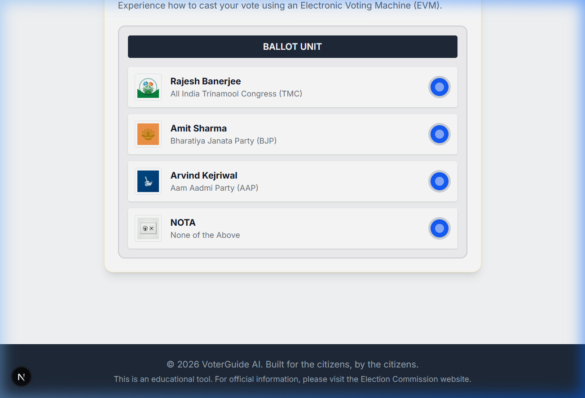

# VoterGuide AI 🇮🇳


An intelligent, accessible, and high-performance **Election Process Education Assistant**. VoterGuide AI is designed to simplify the electoral process, debunk myths, and improve voter readiness for the upcoming 2026 General Elections in India.

## 📖 Overview

VoterGuide AI is a free, lightweight platform that helps citizens navigate the electoral journey with ease. By bringing together modern web technologies and the power of the **Gemini 1.5 Flash AI Truth Engine**, this tool empowers voters to verify facts, track their readiness, and practice casting a vote using an Electronic Voting Machine (EVM) simulation. 

The application is built for the citizens, by the citizens, with a strict focus on a lightweight footprint (<10MB) and blazing-fast performance.

### ✨ Key Features

1. **AI Fact Check (Myth Buster)**
   Powered by Gemini AI, the Fact Check module allows users to instantly verify election-related rumors and rules. It features full **Regional Language Support** (Hindi, Bengali, Tamil, Telugu, Marathi), ensuring accessibility across India. The AI automatically responds in the language chosen by the user.

2. **Voter Readiness Tracker**
   A step-by-step interactive progress tracker designed to guide citizens from checking their electoral roll status to arriving at the polling booth with the correct documents.

3. **EVM Mock Simulation**
   Practice casting your vote! This interactive UI replicates the real EVM and VVPAT process, featuring official political party logos (TMC, BJP, AAP, NOTA) and simulating the beep and print confirmation of a successful vote.



## 🛠 Tech Stack
- **Frontend**: Next.js (App Router), React, Tailwind CSS
- **AI Integration**: Gemini 1.5 Flash API (Native Fetch, Server Actions)
- **Internationalization (i18n)**: Custom global translation dictionary mapped via React State to provide instantaneous UI localization.

## 🚀 Setup & Local Development

Follow these instructions to get the project up and running on your local machine:

### 1. Prerequisites
- Node.js (v18 or higher)
- npm or yarn

### 2. Environment Variables
Rename the provided `.env.example` file to `.env` and insert your Gemini API key to activate the Fact Check module:
```bash
GEMINI_API_KEY="your_api_key_here"
```

### 3. Install Dependencies
Install the required node modules:
```bash
npm install
```

### 4. Run the Development Server
Launch the application locally:
```bash
npm run dev
```
Open [http://localhost:3000](http://localhost:3000) with your browser to explore the assistant.

## 🏗 Architecture & Design
Built with a focus on simplicity, the application uses an agentic state flow to handle user queries securely. By leveraging Next.js Server Actions and native `fetch` over bulky SDK libraries, the project maintains an ultra-fast load time and high Lighthouse scores. 

## ☁️ Deployment

The project is officially deployed and hosted securely on **Google Cloud Run**.

🌍 **Live Website:** [VoterGuide AI on Cloud Run](https://voterguide-ai-60086143162.us-central1.run.app)

### Deploying to Cloud Run
The application is containerized using a multi-stage `Dockerfile` and optimized using Next.js `standalone` output mode to keep the Docker image footprint ultra-lightweight.

To deploy your own instance to Google Cloud Platform, authenticate with your Google account using `gcloud auth login` and run the following command in your terminal:

```bash
gcloud run deploy voterguide-ai \
  --source . \
  --region=us-central1 \
  --allow-unauthenticated \
  --set-env-vars GEMINI_API_KEY="your_api_key_here"
```

---

## ©️ License & Copyright

**Copyright (c) 2026 Ahmed Reja Sk**
All Rights Reserved.

This project was built for educational and demonstration purposes. It is not an official government application. For official election data, please always refer to the Election Commission of India (ECI) website.
